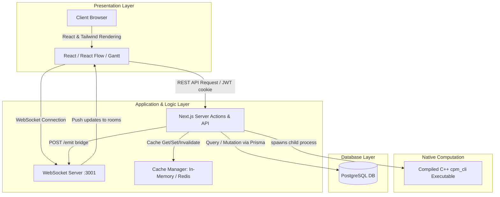
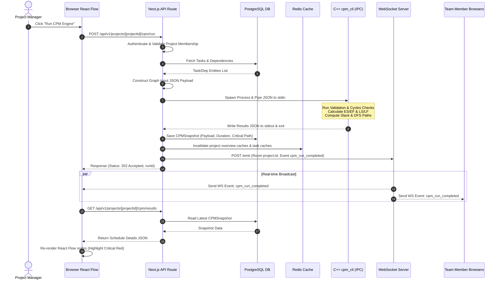

# System Architecture & Component Design

This document details the system design, modular boundaries, and communication flows of the CPM Project Management platform.

---

## 1. High-Level Architecture Overview

The system uses a mixed architectural model: a standard **Three-Tier Web Architecture** (Presentation, Application, Database) coupled with a **Native Computation Worker Pattern** for schedule calculations, and a **Publish-Subscribe Event Bridge** for real-time collaboration.

:::note
Running the scheduling engine as a short-lived process prevents memory leaks and isolates CPU-intensive graph operations from the Node.js event loop.
:::

---

## 2. Component Boundaries & Responsibilities

### A. Frontend Client (React SPA)
- **Technology**: Next.js 16 (Client Components), React Flow (`@xyflow/react`), Zustand, Tailwind CSS v4.
- **Responsibility**: Renders the scheduling dashboard, Gantt timeline, and task dependency graph. Handles user interactions such as dragging nodes, editing details, bulk importing XML files, and configuring automation modes.
- **State Management**: Consumes API endpoints via TanStack React Query. Maintains workspace routing state in Zustand (`workspaceStore.ts`). Consumes WebSocket events to perform optimistic UI updates and queries refetching.

### B. Next.js Application Server
- **Technology**: Node.js, Next.js API Routes (`route.ts`), custom HTTP wrapper (`server.mjs`).
- **Responsibility**: Hosts static assets, runs Server Side rendering, serves REST API endpoints, performs user authentication, manages role-based access controls (RBAC), and manages transactions on the database.
- **Integration Bridge**: Converts Prisma database models into Graph DTO payloads, spawns the C++ binary via Node's `child_process.spawnSync`, handles exit codes, and saves results back to the database as snapshots.

### C. Real-Time Event Hub (WebSocket Server)
- **Technology**: Node.js `ws` library, custom bridge (`ws-server.mjs` and `ws-emitter.ts`).
- **Responsibility**: Maintains active TCP connections with logged-in users. Places clients into project rooms (`project:${projectId}`) after verifying their access tokens (JWT) and database project memberships.
- **HTTP Bridge**: Exposes a secure `/emit` POST endpoint. This allows Next.js API routes (which run in transient server environments) to broadcast events to connected clients by sending a payload to the WebSocket server's HTTP bridge.

### D. Native Computation Worker (C++ CPM CLI)
- **Technology**: C++17, compiled via CMake to `cpm_cli`.
- **Responsibility**: Accepts JSON input from `stdin`, runs Kahn's topological sort, detects cycles, calculates scheduling passes, computes floats, extracts critical paths using Depth-First Search (DFS), and prints JSON output to `stdout`.

### E. Persistence & Caching Layer
- **Technology**: PostgreSQL, Prisma ORM, Redis (`ioredis` with in-memory fallback).
- **Responsibility**: Stores persistent state. Uses Redis for api-response caching (query-cache, activity-cache, project-overview-cache) and rate limiting. Falls back to a local in-memory mock store if Redis is unavailable.

---

## 3. Communication Patterns & Protocols

The platform relies on four communication styles depending on performance requirements:

| Pattern | Protocol | Source | Destination | Purpose |
| :--- | :--- | :--- | :--- | :--- |
| **Request-Response** | HTTPS (JSON REST) | Browser | Next.js API | User actions, CRUD operations, configuration. |
| **Local Inter-process (IPC)** | Stdin/Stdout Pipes | Next.js Server | C++ `cpm_cli` | Performing scheduling calculations. |
| **Publish-Subscribe** | WebSockets (WS) | WebSocket Server | Browser | Distributing real-time updates and notifications. |
| **Server-to-Server Bridge** | HTTP POST | Next.js Server | WebSocket Server | Initiating real-time broadcasts from REST endpoints. |

---

## 4. End-to-End Schedule Recalculation Flow

Here is the sequential flow of scheduling runs:

---

## 5. Layered Architecture & Modular Boundaries

To maintain testability, dependencies only flow inwards:

1. **Routing & Delivery Layer** (`apps/web/src/app`): Decouples request routing, body parsing, and status code delivery from the underlying data services.
2. **Data Repository Layer** (`src/database/repositories.ts`): Wraps the Prisma client. No business logic knows how database queries are constructed; they invoke named repository functions (e.g., `listProjectTasks`).
3. **Caching Layer** (`apps/web/src/lib/*-cache.ts`): Wraps database queries. It manages cache keys, TTL values, and cache invalidation policies, returning data without calling the database if a cache entry is hit.
4. **Integration Layer** (`src/integration/cpmService.ts`): Maps database models to the JSON structures expected by the C++ engine. It isolates the IPC `child_process` call, translating low-level shell execution codes into standard TypeScript Error classes.
