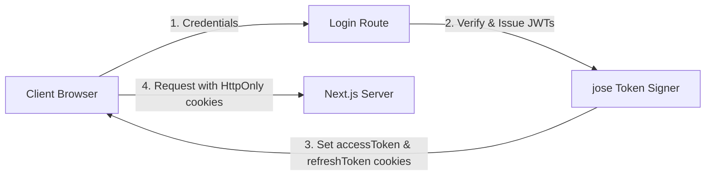

# Authentication & Permissions System

This document describes the security architecture of the CPM platform, covering password cryptography, JWT session management, cookie policies, and granular Role-Based Access Controls (RBAC).

---

## 1. User Registration & Password Hashing

To protect against credential leaks, the database does not store plain text passwords:
- **Hashing Algorithm**: Argon2id (using the `argon2` Node package).
- **Process**: During signup, the server hashes the user's password using a random salt and stores the resulting hash in the `passwordHash` field of the `User` table.
- **Verification**: During login, the server matches the provided password against the stored hash using `verify(user.passwordHash, password)`.

---

## 2. Session Management via JWT & Cookies

The platform uses a stateless, token-based session management system stored in secure client cookies.

### A. Session Cookies Configuration
Upon successful login, two JSON Web Tokens (JWTs) are signed using `jose` and set in the user's browser cookies:
- **`accessToken`**: Extends session access.
- **`refreshToken`**: Extends session renewal.

:::warning
Both cookies utilize the `HttpOnly` flag to prevent access from client-side JS scripts (XSS mitigation), and the `Secure` flag to enforce transmission over HTTPS.
:::

Both cookies are configured with the following flags to prevent scripting attacks and eavesdropping:
- `HttpOnly: true` (prevents client-side scripts like `document.cookie` from reading the token, mitigating XSS risks).
- `Secure: true` (ensured in production environments so cookies are sent only over HTTPS).
- `Path: /` (makes cookies available across all subroutes of the application).
- `Max-Age: 7 days` (session duration matches the token expiration date).

### B. Session Verification (`getSession`)
For server-rendered components, the helper function `getSession()` in `apps/web/src/lib/auth.ts` extracts and validates the access token:
- **JWT Verification**: Decodes the token using the system `JWT_SECRET`.
- **Deduplication Cache**: Wrapped in React's `cache()` function, this utility dedupes database validation checks. If multiple nested server components in a single render tree invoke `getSession()`, the JWT decoding and database lookup run exactly once, optimizing request latency.

---

## 3. Workspace Role-Based Access Control (RBAC)

Access levels are structured into two hierarchical tiers: **Workspace Roles** and **Project Roles**.

### A. Workspace Membership Roles
Workspace roles determine general administrative control over project directories, billing, and team memberships:

| Role Name | Description / Permissions |
| :--- | :--- |
| **OWNER** | Full root administrative access. Can delete the workspace, rename slugs, invite members, and change billing settings. |
| **ADMIN** | Can create projects, invite workspace members, delete any project, and define custom project roles. |
| **MEMBER** | Can view public projects and join invited project teams. Cannot create workspace-level roles. |
| **VIEWER** | Read-only access to workspace statistics. Cannot modify any workspace metadata. |

---

## 4. Project Membership & Custom Roles

Inside a project, access control is managed by project-specific membership roles and custom permission sets defined in the database:

### A. Standard Project Roles

| Role Name | Description / Permissions |
| :--- | :--- |
| **PROJECT OWNER** | Full control over the project. Can delete the project, run scheduling runs, and modify memberships. |
| **PROJECT ADMIN** | Can create, edit, and delete tasks and dependencies. Can invite members to the project. |
| **PROJECT MEMBER** | Can create and edit tasks. Can trigger CPM runs. Can create project comments. |
| **PROJECT VIEWER** | Read-only access to tasks, Gantt views, and graphs. Cannot trigger scheduling runs. |

### B. Project Custom Roles (`ProjectCustomRole`)
For complex teams, administrators can define custom roles with granular permission flags stored in the database:
- `canCreateTask` (boolean)
- `canDeleteTask` (boolean)
- `canManageDependencies` (boolean)
- `canTriggerCpm` (boolean)
- `canPostAnnouncements` (boolean)
- `canManageMembers` (boolean)

These permissions are checked by Next.js API routes before performing database writes, returning a `403 Forbidden` error if the user's role lacks the required permissions.
