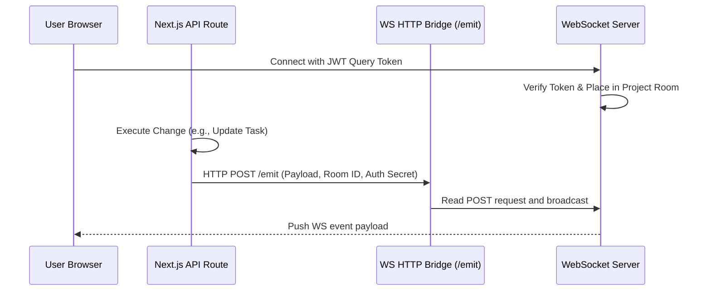
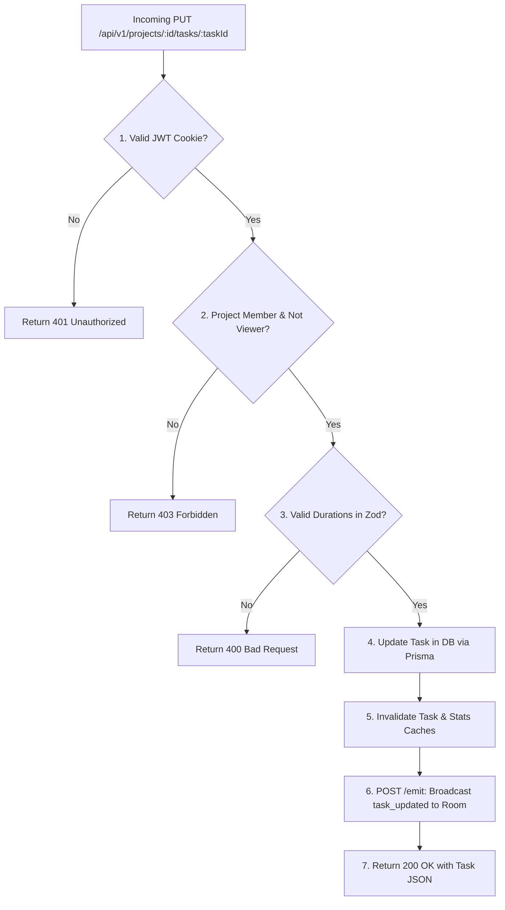

# Backend Server Architecture & Integration

This document details the backend design of the CPM platform, outlining API routes, custom WebSocket servers, caching policies, compiled C++ integration, and backend request lifecycles.

---

## 1. Server Architecture & Execution Environments

The backend is composed of two servers running concurrently in a Node.js runtime:
1. **Next.js API Server** (`server.mjs`): Listens on port 3000. It hosts client routes, server actions, and REST API controllers.
2. **WebSocket Server** (`ws-server.mjs`): Listens on port 3001 in standalone mode, or hooks directly into port 3000 in unified mode. It handles persistent TCP connections and room-based broadcasts.

---

## 2. API Routes & Service Layer

Business logic is organized into mock controllers located in Next.js API endpoints (`apps/web/src/app/api/v1/`), which interact with database repositories (`src/database/repositories.ts`):

- **Auth Service**: Manages login/signup. Hashes passwords using `argon2` and signs cookie-based JWT sessions using `jose`.
- **Project Service**: Manages projects, tags, departments, and custom roles.
- **Task & Dependency Service**: Coordinates CRUD operations, validations, and bulk updates.
- **CPM Integration Service**: Orchestrates pipeline execution by spawning the C++ scheduler.

---

## 3. C++ Scheduling Engine Integration (`cpmService.ts`)

The backend interfaces with the native compiled C++ CLI executable (`build/cpm_cli`) using a spawned process model:

```mermaid
graph LR
    NextJS[Next.js Backend] -->|1. Fetch DB Tasks & Deps| Postgres[(PostgreSQL)]
    NextJS -->|2. Map to GraphInput DTO| IPC[spawnSync Child Process]
    IPC -->|3. Pipe Input to stdin| CppCLI[build/cpm_cli Executable]
    Note over CppCLI: Run topological pass<br/>and float calculations
    CppCLI -->|4. Pipe Output to stdout| IPC
    IPC -->|5. JSON Parse CPMResult| NextJS
    NextJS -->|6. Save CPMSnapshot| Postgres
```

### Process Spawning Details
- **Command**: `spawnSync(join(process.cwd(), 'build', 'cpm_cli'), [], { input: JSON.stringify(payload), encoding: 'utf-8', maxBuffer: 50MB })`.
- **Data Exchange**: Inputs are piped directly to the child process's `stdin` as a stringified JSON graph. The executable returns results to `stdout` or writes validation errors to `stderr`.
- **Timeout and Buffers**: A `maxBuffer` of 50MB is allocated to accommodate large graphs (up to 5,000 tasks).
- **Error Mapping**: If the process exits with a non-zero code, `cpmService.ts` parses `stderr` (e.g. `{"error": "Cycle detected: A -> B -> A"}`) and throws a `CpmIntegrationError`. This is caught by API controllers to return clean client error responses.

---

## 4. Real-time WebSocket Event Bridge

Because Next.js App Router API routes execute in transient, isolated request threads, they cannot directly access client TCP sockets. The platform resolves this with a **Server-to-Server Event Bridge**:



1. **Authentication**: When a client initiates a WebSocket connection (`ws://localhost:3000/`), it passes a JWT token in the connection URL parameters. The server verifies the token and adds the socket connection to a Project Room (`project:${projectId}`) after verifying project membership.
2. **The Emit Bridge**: When a database change occurs, the API route makes a local HTTP POST request to `/emit` on the WebSocket server (secured by an `EMIT_SECRET` token). The WS server parses this and broadcasts the payload to all sockets in that project room.

---

## 5. Caching Layer & Invalidation Policies

The database is insulated from high-frequency queries using a dual-caching strategy (using Redis with in-memory fallback):

### A. Caching Controllers (`project-overview-cache.ts`, `query-cache.ts`)
- **Project Stats Cache**: Caches task counts, overdue counts, and dependency statistics for 5 minutes.
- **Project Summary Cache**: Caches metadata, latest snapshot dates, and critical paths.
- **Team Stats Cache**: Caches member roles and active user counts.
- **Department Breakdown Cache**: Caches task completions and critical path percentages grouped by department.

### B. Invalidation Triggers
To maintain data consistency, specific database mutations invalidate target cache groups:
- **Task Creation / Edit**: Invalidates `projectStats`, `projectHealth`, and `departmentBreakdown`.
- **CPM Run**: Invalidates all project-related caches (`stats`, `health`, `departments`, `summary`).
- **Team Assignment**: Invalidates `teamStats` caches.

---

## 6. Request Lifecycle Walkthrough

The diagram below maps the lifecycle of an incoming API request to edit a task duration:


