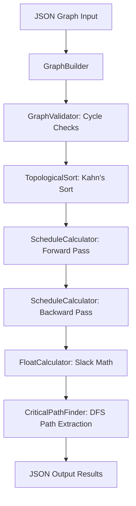

import Tabs from '@theme/Tabs';
import TabItem from '@theme/TabItem';

# Critical Path Method (CPM) Engine Reference

This document provides a detailed technical reference for the Critical Path Method (CPM) scheduling engine, detailing both the native C++ engine (`cpm_cli`) and the JavaScript fallback engine.

---

## 1. Engine Architecture & Component Overview

The scheduling engine operates as a sequential transformation pipeline. Each phase acts on a directed project graph structure to calculate scheduling coordinates and isolate critical tasks.



---

## 2. Core Graph Data Structures

Below is a comparison of how the graph nodes are structured in the two scheduling engines:

<Tabs>
  <TabItem value="cpp" label="C++ Structures (cpm_types.h)" default>
    ```cpp
    struct Task {
        std::string id;
        double duration;          // Duration in days (can be fractional)
        DateTime early_start;     // Calculated ES
        DateTime early_finish;    // Calculated EF
        DateTime late_start;      // Calculated LS
        DateTime late_finish;     // Calculated LF
        double total_float;       // TF (Slack in days)
        double free_float;        // FF (Slack in days)
        bool is_critical;         // True if total_float ≈ 0
    };

    struct Dependency {
        std::string predecessor_id;
        std::string successor_id;
        DependencyType type;      // FS, SS, FF, SF
        double lag;               // Lead/lag delay time
        LagUnit lag_unit;         // DAYS, HOURS, WEEKS
    };
    ```
  </TabItem>
  <TabItem value="js" label="JavaScript Fallback Objects">
    ```javascript
    // Nodes mapped in route.ts
    const node = {
      id: task.id,
      duration: Number(task.duration),
      predecessors: [],
      successors: [],
      es: 0,
      ef: Number(task.duration),
      ls: 0,
      lf: 0,
      slack: 0,
      isCritical: false,
      indegree: 0
    };
    ```
  </TabItem>
</Tabs>

---

## 3. Core Algorithms & Scheduling Logic

### A. Cycle Detection (In-Degree Validation)
Before scheduling, the graph is validated to ensure it is a Directed Acyclic Graph (DAG):
1. An `in_degree` counter map is initialized for all tasks.
2. For each dependency, the successor's `in_degree` is incremented.
3. Tasks with an in-degree of `0` (no predecessors) are added to a queue.
4. While the queue is not empty, nodes are popped, successor in-degrees are decremented, and nodes hitting `0` in-degree are queued.
5. If the count of processed nodes is less than the total node count, a cycle is detected and the run aborts.

### B. The Forward Pass (Earliest Dates)
Calculates **Earliest Start (ES)** and **Earliest Finish (EF)** in topological order:
1. Initialize tasks: `ES = project_start`, `EF = project_start + duration`.
2. For each task `j`, incoming dependencies from predecessors `i` are evaluated:

| Dependency Type | Formula for Successor Earliest Start (`ES_j`) |
| :--- | :--- |
| **Finish-to-Start (FS)** | `ES_j = max(ES_j, EF_i + lag)` |
| **Start-to-Start (SS)** | `ES_j = max(ES_j, ES_i + lag)` |
| **Finish-to-Finish (FF)** | `EF_j = max(EF_j, EF_i + lag) => ES_j = EF_j - duration_j` |
| **Start-to-Finish (SF)** | `EF_j = max(EF_j, ES_i + lag) => ES_j = EF_j - duration_j` |

3. The overall project finish is the maximum earliest finish:
   `project_finish = max(EF_k) for all tasks k`

### C. The Backward Pass (Latest Dates)
Calculates **Latest Finish (LF)** and **Latest Start (LS)** in reverse topological order:
1. Initialize tasks: `LF = project_finish`, `LS = project_finish - duration`.
2. For each task `i`, successors `j` are evaluated:

| Dependency Type | Formula for Predecessor Latest Finish (`LF_i`) |
| :--- | :--- |
| **Finish-to-Start (FS)** | `LF_i = min(LF_i, LS_j - lag)` |
| **Start-to-Start (SS)** | `LS_i = min(LS_i, LS_j - lag) => LF_i = LS_i + duration_i` |
| **Finish-to-Finish (FF)** | `LF_i = min(LF_i, LF_j - lag)` |
| **Start-to-Finish (SF)** | `LS_i = min(LS_i, LF_j - lag) => LF_i = LS_i + duration_i` |

---

## 4. Float Calculations & Critical Path Isolation

### A. Total Float (TF)
Total Float is the amount of time a task can slide without delaying the project finish date:
`Total Float (TF) = LS - ES = LF - EF`

### B. Free Float (FF)
Free Float is the amount of time a task can slide without delaying any successor task's earliest start:
`Free Float (FF) = max(0.0, min(ES_j) - EF_i) for all successors j of i`

### C. Critical Path Extraction (DFS)
A task is classified as **critical** if its total float is approximately zero, evaluated using a small float threshold:
`IsCritical(Task) <=> |TF| < 1e-9`
1. Find all **Critical Start Tasks**: critical tasks that have no critical predecessors.
2. Run a Depth-First Search (DFS) from each critical start node, traversing only critical edges (edges connecting two critical tasks).
3. If multiple parallel critical paths are discovered, the engine sums task durations along each path:
   `Path Duration = sum(duration(t)) for all tasks t on path`
   The path with the longest total duration is returned as the primary **Critical Path**.
