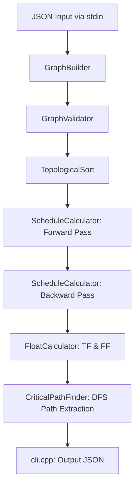
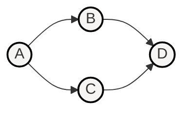
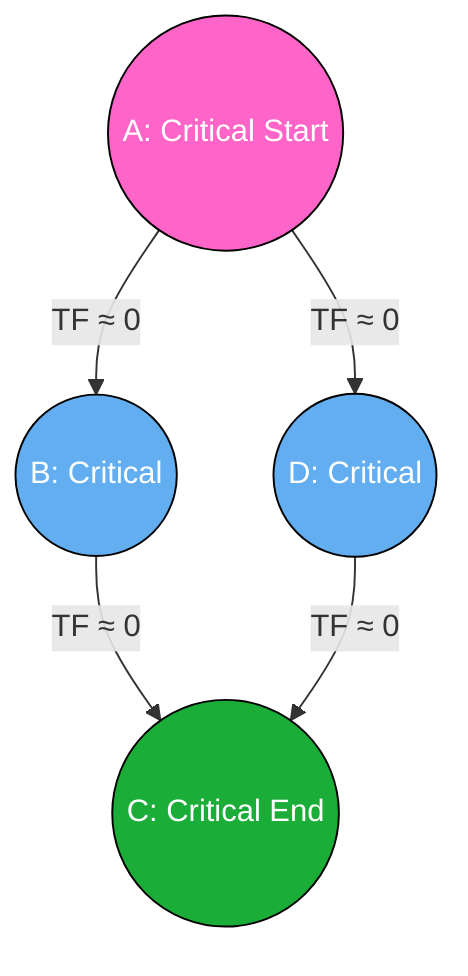

# Critical Path Method (CPM) Engine Reference Guide

This document provides a comprehensive analysis of the C++ Critical Path Method (CPM) engine. It details the internal architecture, step-by-step execution workflow, mathematical formulations, graph algorithms, and critical path extraction logic.

---

## 1. Architecture & Component Overview

The CPM engine is designed as a modular pipeline where each stage performs a specific transformation on the project graph. The interface is defined in `engine/include/` and the implementations reside in `engine/src/`.



### Component Map

| Component / File | Purpose & Responsibility |
| :--- | :--- |
| **`cpm_types.h`** | Defines the core domain models: `Task`, `Dependency`, `ProjectGraph`, `DependencyType` (FS, SS, FF, SF), and `LagUnit` (days, hours, weeks). Also contains datetime parsing/arithmetic helper functions. |
| **`graph_builder.cpp`** | Implements the Builder design pattern to construct the `ProjectGraph`. It performs structural checks (duplicate IDs, non-empty IDs) and sets up adjacency lists. |
| **`graph_validator.cpp`** | Evaluates the constructed `ProjectGraph` for semantic correctness: ensuring it is non-empty, contains no negative durations, all task references exist, and no cycles exist. |
| **`topological_sort.cpp`** | Implements Kahn's Algorithm to generate a valid topological ordering of tasks, and calculates rank/depth levels for visualization. |
| **`schedule_calculator.cpp`** | Computes scheduled dates: performs the Forward Pass (ES & EF) and Backward Pass (LS & LF), handling lead/lag times and all dependency types (FS, SS, FF, SF). |
| **`float_calculator.cpp`** | Computes Total Float (TF) and Free Float (FF) for each task, identifying critical tasks where total float is approximately zero. |
| **`critical_path_finder.cpp`** | Traces critical paths using Depth-First Search (DFS) starting from critical start tasks, and identifies the longest representative path. |
| **`cli.cpp`** | The main entry point. Orchestrates the pipeline: reads JSON from `stdin`, executes calculations, and prints JSON results to `stdout`. |

---

## 2. Core Graph Data Structures (`cpm_types.h`)

The project schedule is represented internally as a Directed Acyclic Graph (DAG) using the `ProjectGraph` structure:

```cpp
struct ProjectGraph {
    std::map<std::string, Task> tasks;                           // All tasks indexed by ID
    std::vector<Dependency> dependencies;                        // Raw list of dependency edges
    DateTime project_start;                                      // Reference project start date
    DateTime project_finish;                                     // Computed project finish date
    
    // Adjacency lists for fast traversal:
    std::map<std::string, std::vector<std::string>> successors;   // Task ID -> [Successor IDs]
    std::map<std::string, std::vector<std::string>> predecessors;  // Task ID -> [Predecessor IDs]
};
```

### Task Representation
```cpp
struct Task {
    std::string id;
    double duration;          // Duration in days (can be fractional)
    
    // Computed Schedule Attributes:
    DateTime early_start;     // ES
    DateTime early_finish;    // EF
    DateTime late_start;      // LS
    DateTime late_finish;     // LF
    double total_float;       // TF (Slack in days)
    double free_float;        // FF (Slack in days)
    bool is_critical;         // True if on the critical path
};
```

### Dependency Representation
```cpp
struct Dependency {
    std::string predecessor_id;
    std::string successor_id;
    DependencyType type;      // FS, SS, FF, SF
    double lag;               // Time delay
    LagUnit lag_unit;         // DAYS, HOURS, WEEKS
    double strength;          // Constraint stiffness (1.0 = hard constraint)
};
```

---

## 3. Detailed Algorithmic Workflow

### Step 1: Parsing & Adjacency Construction
1. `cli.cpp` reads input from `stdin` and parses the JSON.
2. For each task, `GraphBuilder::addTask` validates that the ID is unique and non-empty, then adds it to `ProjectGraph::tasks`.
3. For each dependency, `GraphBuilder::addDependency` records the link.
4. `GraphBuilder::build()` validates references and constructs adjacency structures:
   - For each dependency edge, it populates `graph->successors[predecessor_id].push_back(successor_id)` and `graph->predecessors[successor_id].push_back(predecessor_id)`.

---

### Step 2: Graph Validation & Cycle Detection
Before starting execution, `GraphValidator::validateGraph` executes four sanity checks:
1. **Non-empty Check**: Confirms `tasks` map contains at least one node.
2. **Duration Check**: Confirms `duration >= 0` for all tasks.
3. **Reference Check**: Confirms that both `predecessor_id` and `successor_id` for every dependency exist in the `tasks` list.
4. **Cycle Detection**: Verifies that the graph is a Directed Acyclic Graph (DAG).

#### Cycle Detection Logic
Cycle detection uses an in-degree counting algorithm (the preprocessing stage of Kahn's Algorithm):
1. An `in_degree` map is initialized to `0` for all tasks.
2. For each dependency, `in_degree[dependency.successor_id]` is incremented.
3. All tasks with `in_degree == 0` (no predecessors) are pushed onto a queue.
4. While the queue is not empty:
   - Pop a task, increment the `processed_count`.
   - For each successor of this task, decrement its `in_degree`.
   - If a successor's `in_degree` reaches `0`, push it onto the queue.
5. If `processed_count != total_tasks`, a cycle is present in the graph. The algorithm detects this circular dependency and raises a `CpmComputationError`.

---

### Step 3: Topological Sorting (`topological_sort.cpp`)
To calculate earliest and latest start dates, tasks must be processed in an order where all of a task's predecessors are processed before the task itself.


*Topological Order: [A, B, C, D] or [A, C, B, D]*

The engine implements **Kahn's Algorithm** for sorting:
1. **Initialize In-Degrees**: Computes the number of predecessors for each task.
2. **Seed Queue**: Enqueues all nodes with an in-degree of `0`.
3. **Traverse & Decrement**:
   - Dequeues task $u$ and appends it to the result vector `topo_order`.
   - For each neighbor $v$ connected by directed edge $u \to v$, decrement `in_degree[v]`.
   - If `in_degree[v] == 0`, enqueue $v$.
4. **Validation Check**: If the resulting `topo_order` size is less than the graph size, it throws a DAG violation error.
5. **Visual Depth/Rank Hints**:
   - An auxiliary pass computes level/rank for visualization:
     $$\text{level}[u] = \max_{p \in \text{predecessors}(u)} (\text{level}[p]) + 1$$
     (Root tasks start at level `0`).

---

### Step 4: The Forward Pass (`schedule_calculator.cpp`)
The Forward Pass calculates the **Earliest Start (ES)** and **Earliest Finish (EF)** for all tasks in topological order.

#### Mathematical Formulations per Dependency Type
For a successor task $j$ with predecessor $i$ and lag $L$ (converted to days):

| Dependency Type | Constraint Rule | Formula for Successor Earliest Start ($ES_j$) |
| :--- | :--- | :--- |
| **Finish-to-Start (FS)** | Task $j$ cannot start until Task $i$ finishes + lag. | $ES_j = EF_i + L$ |
| **Start-to-Start (SS)** | Task $j$ cannot start until Task $i$ starts + lag. | $ES_j = ES_i + L$ |
| **Finish-to-Finish (FF)** | Task $j$ cannot finish until Task $i$ finishes + lag. | $EF_j = EF_i + L \implies ES_j = EF_i + L - \text{duration}_j$ |
| **Start-to-Finish (SF)** | Task $j$ cannot finish until Task $i$ starts + lag. | $EF_j = ES_i + L \implies ES_j = ES_i + L - \text{duration}_j$ |

#### Forward Pass Algorithm
1. Initialize all tasks: $ES = \text{project\_start}$, $EF = \text{project\_start} + \text{duration}$.
2. Traverse each task $j$ in the computed `topo_order`:
   - If $j$ has no predecessors, $ES_j = \text{project\_start}$.
   - If $j$ has predecessors:
     $$ES_j = \max_{i \in \text{predecessors}(j)} \left( \text{getSuccessorEarliestStart}(i, \text{dependency}_{i \to j}) \right)$$
   - Calculate early finish:
     $$EF_j = ES_j + \text{duration}_j$$
3. Compute overall project finish date:
   $$\text{project\_finish} = \max_{k \in \text{tasks}} (EF_k)$$

---

### Step 5: The Backward Pass (`schedule_calculator.cpp`)
The Backward Pass calculates the **Latest Finish (LF)** and **Latest Start (LS)** for each task in **reverse topological order**, ensuring the overall project completion date is not delayed.

#### Mathematical Formulations per Dependency Type
For a predecessor task $i$ with successor $j$ and lag $L$:

| Dependency Type | Constraint Rule | Formula for Predecessor Latest Finish ($LF_i$) |
| :--- | :--- | :--- |
| **Finish-to-Start (FS)** | Predecessor must finish before successor starts - lag. | $LF_i = LS_j - L$ |
| **Start-to-Start (SS)** | Predecessor must start before successor starts - lag. | $LS_i = LS_j - L \implies LF_i = LS_j - L + \text{duration}_i$ |
| **Finish-to-Finish (FF)** | Predecessor must finish before successor finishes - lag. | $LF_i = LF_j - L$ |
| **Start-to-Finish (SF)** | Predecessor must start before successor finishes - lag. | $LS_i = LF_j - L \implies LF_i = LF_j - L + \text{duration}_i$ |

#### Backward Pass Algorithm
1. Traverse each task $i$ in **reverse topological order** (using the reverse iterator of `topo_order`):
   - If $i$ has no successors (it is a sink node), then $LF_i = \text{project\_finish}$.
   - If $i$ has successors:
     $$LF_i = \min_{j \in \text{successors}(i)} \left( \text{getPredecessorLatestFinish}(j, \text{dependency}_{i \to j}) \right)$$
   - Calculate late start:
     $$LS_i = LF_i - \text{duration}_i$$

---

### Step 6: Float Calculation (`float_calculator.cpp`)
Float (or slack) defines the scheduling flexibility of each task.

```
Task A: |===== Early =====|
        |======= Late =======|  <-- Difference is Total Float (TF)
```

#### Total Float (TF)
Total Float represents the amount of time a task can be delayed from its early start date without delaying the overall project finish date.
$$\text{Total Float} (TF) = LS - ES = LF - EF$$

#### Free Float (FF)
Free Float is the amount of time a task can be delayed without delaying the early start date of any successor task.
$$\text{Free Float} (FF) = \max \left( 0.0, \min_{j \in \text{successors}(i)} (ES_j) - EF_i \right)$$
*(If a task has no successors, its Free Float is defined as `0.0`).*

#### Identifying Critical Tasks
A task is classified as **critical** if its total float is approximately zero. Because of floating-point arithmetic precision constraints, the engine evaluates this condition using an absolute tolerance ($10^{-9}$ days):
$$\text{IsCritical}(Task) \iff |TF| < 10^{-9}$$
Tasks that meet this criteria are flagged: `task.is_critical = true`.

---

## 4. Critical Path Generation & Selection

A **critical path** is a continuous sequence of critical tasks from a start task to an end task. The engine performs a two-stage extraction process: locating all possible critical paths and returning the longest one.



### Stage 1: Finding Critical Start and End Nodes
- **Critical Start Task**: A task that is critical (`total_float ≈ 0`) and has no critical predecessors.
  ```cpp
  bool CriticalPathFinder::isCriticalStart(const ProjectGraph& graph, const std::string& task_id) {
      if (!isCritical(task)) return false;
      for (const auto& pred_id : predecessors[task_id]) {
          if (isCritical(pred_id)) return false; // Not a start node
      }
      return true;
  }
  ```
- **Critical End Task**: A task that is critical (`total_float ≈ 0`) and has no critical successors.
  ```cpp
  bool CriticalPathFinder::isCriticalEnd(const ProjectGraph& graph, const std::string& task_id) {
      if (!isCritical(task)) return false;
      for (const auto& succ_id : successors[task_id]) {
          if (isCritical(succ_id)) return false; // Not an end node
      }
      return true;
  }
  ```

### Stage 2: Depth-First Search (DFS) Traversal
`CriticalPathFinder::findAllCriticalPaths` discovers all paths by traversing the critical sub-graph using DFS:
1. Collects all tasks that satisfy `isCriticalStart()`.
2. For each critical start task, it initiates a recursive DFS pathfinder `findPathsDFS`:
   - Appends the current task ID to the current path stack.
   - Identifies all **critical successors** (successors where `total_float ≈ 0`).
   - If no critical successors exist:
     - The path is complete. The stack is saved to the list of `all_paths`.
   - If critical successors exist:
     - Recurses into each critical successor.
   - Backtracks by popping the current task from the stack before returning.

### Stage 3: Longest Critical Path Selection
To resolve cases with multiple parallel critical paths (such as redundant critical branches), `findLongestCriticalPath` computes the cumulative sum of task durations for each discovered path:
$$\text{Path Duration} = \sum_{t \in \text{Path}} \text{duration}(t)$$
It compares all paths and returns the path containing the maximum total duration. If multiple paths have identical total durations, it defaults to the first one discovered during traversal.

---

## 5. End-to-End Execution Example

Here is a step-by-step example tracing a simple project through the CPM engine.

### Input JSON
```json
{
  "tasks": [
    { "id": "A", "duration": 3.0 },
    { "id": "B", "duration": 4.0 },
    { "id": "C", "duration": 2.0 },
    { "id": "D", "duration": 5.0 }
  ],
  "dependencies": [
    { "from": "A", "to": "B" },
    { "from": "A", "to": "C" },
    { "from": "B", "to": "D" },
    { "from": "C", "to": "D" }
  ]
}
```

### Execution Steps & State Trace

#### 1. Parse & Build
- Tasks: `A` (3.0d), `B` (4.0d), `C` (2.0d), `D` (5.0d)
- Successors: `A` $\to$ `[B, C]`, `B` $\to$ `[D]`, `C` $\to$ `[D]`, `D` $\to$ `[]`
- Predecessors: `A` $\to$ `[]`, `B` $\to$ `[A]`, `C` $\to$ `[A]`, `D` $\to$ `[B, C]`

#### 2. Validation & Sorting
- In-degrees: `A:0`, `B:1`, `C:1`, `D:2`
- Queue seeds: `[A]`
- Process queue:
  - Pop `A`. Successor in-degrees become `B:0`, `C:0`. Enqueue `B` and `C`.
  - Pop `B`. Successor `D` in-degree becomes `D:1`.
  - Pop `C`. Successor `D` in-degree becomes `D:0`. Enqueue `D`.
  - Pop `D`.
- Topological Order: `[A, B, C, D]` (No cycles, valid DAG).

#### 3. Forward Pass (Project Start Day = 0.0)
- **Task A** (No predecessors):
  - $ES_A = 0.0$
  - $EF_A = 0.0 + 3.0 = 3.0$
- **Task B** (Predecessor A):
  - $ES_B = EF_A = 3.0$
  - $EF_B = 3.0 + 4.0 = 7.0$
- **Task C** (Predecessor A):
  - $ES_C = EF_A = 3.0$
  - $EF_C = 3.0 + 2.0 = 5.0$
- **Task D** (Predecessors B, C):
  - $ES_D = \max(EF_B, EF_C) = \max(7.0, 5.0) = 7.0$
  - $EF_D = 7.0 + 5.0 = 12.0$
- **Project Finish**: $\max(3.0, 7.0, 5.0, 12.0) = 12.0$

#### 4. Backward Pass (Project Finish Day = 12.0)
- **Task D** (No successors/Sink):
  - $LF_D = 12.0$
  - $LS_D = 12.0 - 5.0 = 7.0$
- **Task B** (Successor D):
  - $LF_B = LS_D = 7.0$
  - $LS_B = 7.0 - 4.0 = 3.0$
- **Task C** (Successor D):
  - $LF_C = LS_D = 7.0$
  - $LS_C = 7.0 - 2.0 = 5.0$
- **Task A** (Successors B, C):
  - $LF_A = \min(LS_B, LS_C) = \min(3.0, 5.0) = 3.0$
  - $LS_A = 3.0 - 3.0 = 0.0$

#### 5. Float & Criticality Calculation
- **Task A**: $TF = LS - ES = 0.0 - 0.0 = 0.0$ (Critical)
- **Task B**: $TF = LS - ES = 3.0 - 3.0 = 0.0$ (Critical)
- **Task C**: $TF = LS - ES = 5.0 - 3.0 = 2.0$ (Non-critical, can slide by 2 days)
- **Task D**: $TF = LS - ES = 7.0 - 7.0 = 0.0$ (Critical)

*Free Float (FF) calculations:*
- **Task A**: $\min(ES_B, ES_C) - EF_A = \min(3.0, 3.0) - 3.0 = 0.0$
- **Task B**: $\min(ES_D) - EF_B = 7.0 - 7.0 = 0.0$
- **Task C**: $\min(ES_D) - EF_C = 7.0 - 5.0 = 2.0$
- **Task D**: No successors $\implies 0.0$

#### 6. Critical Path Finder
- Critical Start tasks: `A` (critical, predecessor `[]` has no critical task).
- DFS from `A`:
  - Successors of `A` are `B` (critical) and `C` (non-critical). Follow `B`.
  - Successor of `B` is `D` (critical). Follow `D`.
  - `D` has no successors. Path `[A, B, D]` completed.
- Longest path duration: $Duration(A) + Duration(B) + Duration(D) = 3.0 + 4.0 + 5.0 = 12.0$ days.

#### Output JSON Result
```json
{
  "result": {
    "projectDuration": 12.0,
    "criticalPath": ["A", "B", "D"],
    "tasks": [
      { "id": "A", "earliest_start": 0.0, "earliest_finish": 3.0, "latest_start": 0.0, "latest_finish": 3.0, "float_time": 0.0 },
      { "id": "B", "earliest_start": 3.0, "earliest_finish": 7.0, "latest_start": 3.0, "latest_finish": 7.0, "float_time": 0.0 },
      { "id": "C", "earliest_start": 3.0, "earliest_finish": 5.0, "latest_start": 5.0, "latest_finish": 7.0, "float_time": 2.0 },
      { "id": "D", "earliest_start": 7.0, "earliest_finish": 12.0, "latest_start": 7.0, "latest_finish": 12.0, "float_time": 0.0 }
    ]
  }
}
```
