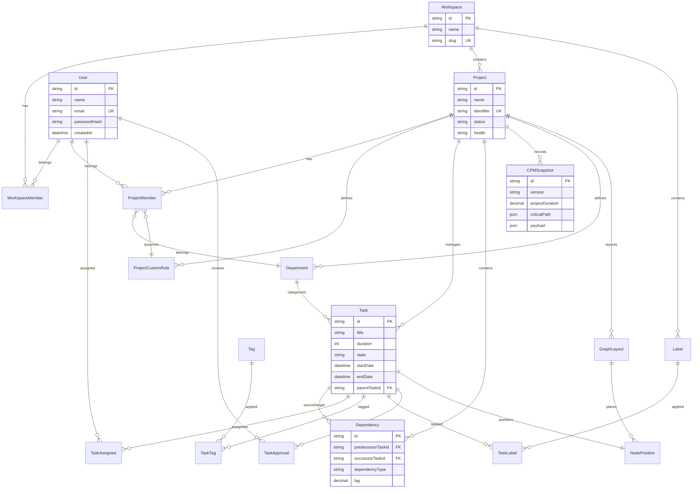

# Database Architecture & Schema Design

This document details the database architecture, entity designs, schema relations, unique constraints, indexes, validation suites, and database performance benchmarks of the CPM platform.

---

## 1. Database Technology Selection
- **Database Engine**: PostgreSQL (v15+). Chosen for its strong ACID compliance, robust indexing support for nested relations, and support for high-throughput reads.
- **ORM / Migration**: Prisma. Provides a type-safe declarative schema syntax (`schema.prisma`) and automated migration generation.

---

## 2. Entity-Relationship (ER) Diagram

The diagram below outlines the core tables, relationships, and roles in the database.

---

## 3. Detailed Table Index & Schema Specifications

### Core Workspace Entities

#### `Workspace`
- **Purpose**: Defines organizational boundaries.
- **Fields**: `id` (cuid, PK), `name` (string), `slug` (string, UK), `createdAt` (datetime), `updatedAt` (datetime).
- **Constraints**: `@@unique([slug])`

#### `WorkspaceMember`
- **Purpose**: Map users to workspaces with a base role.
- **Fields**: `workspaceId` (FK), `userId` (FK), `role` (OWNER, ADMIN, MEMBER, VIEWER).
- **Constraints**: `@@id([workspaceId, userId])` (composite PK).

---

### Project & Collaboration Entities

#### `Project`
- **Purpose**: Represents a project containing scheduling tasks and members.
- **Fields**: `id` (cuid, PK), `workspaceId` (FK), `name`, `identifier` (unique slug), `startDate`, `targetDate`, `status` (DRAFT, ACTIVE, DELAYED, COMPLETED), `health` (HEALTHY, WARNING, AT_RISK), `ownerId` (FK).
- **Constraints**: `@@unique([workspaceId, identifier])`.

#### `ProjectMember`
- **Purpose**: Manages membership roles inside projects.
- **Fields**: `projectId` (FK), `userId` (FK), `role` (string), `departmentId` (FK), `customRoleId` (FK).
- **Constraints**: `@@id([projectId, userId])`.

---

### Task & Scheduling Entities

#### `Task`
- **Purpose**: Represents an item of work with scheduling coordinates.
- **Fields**: `id` (custom string, PK), `projectId` (FK), `title`, `description`, `duration` (integer days), `estimatedDays`, `startDate` (calculated ES), `endDate` (calculated EF), `state` (BACKLOG, TODO, IN_PROGRESS, REVIEW, DONE, CANCELED), `parentTaskId` (self-relation FK).
- **Indexes**:
  - `@@index([projectId])` (fast loads of project tasks during CPM calculations).
  - `@@index([parentTaskId])` (parent hierarchy lookups).
  - `@@index([deletedAt])` (filters out soft-deleted items).

#### `Dependency`
- **Purpose**: Connects predecessor tasks to successor tasks.
- **Fields**: `id` (cuid, PK), `projectId` (FK), `predecessorTaskId` (FK), `successorTaskId` (FK), `dependencyType` (FS, SS, FF, SF), `lag` (decimal), `lagUnit` (days, hours, weeks), `strength` (decimal stiffness).
- **Constraints**:
  - `@@unique([predecessorTaskId, successorTaskId, dependencyType])` (prevents redundant edges).
- **Indexes**:
  - `@@index([predecessorTaskId])` (forward pass traversal).
  - `@@index([successorTaskId])` (backward pass traversal).

#### `CPMSnapshot`
- **Purpose**: Stores historical calculations computed by the C++ engine.
- **Fields**: `id` (cuid, PK), `projectId` (FK), `version` (string), `calculationTime` (datetime), `projectDuration` (decimal), `criticalPath` (JSON string array), `payload` (JSON task-by-task slack details).
- **Indexes**:
  - `@@index([projectId, version])`
  - `@@index([calculationTime])`

---

## 4. Integrity Constraints & Database Validation

To ensure database consistency, the repository includes verification scripts in `database/tests/`:
1. **Constraint Testing** (`database/tests/constraints.test.ts`): Verifies unique violations (e.g., duplicate emails, workspace slug duplicates, identical dependencies).
2. **Referential Integrity Testing** (`database/tests/validation.test.ts`): Asserts cascade deletions (e.g., deleting a project deletes all associated tasks, dependencies, and members).
3. **DAG Invariant Auditing**: Checks that no self-referencing dependencies exist (`predecessorTaskId != successorTaskId`) and that durations are non-negative.

---

## 5. Performance & Volume Benchmarking

The database performance suite in `scripts/` supports stress-testing and index optimization:
- **Test Scripts**:
  - `db_benchmark_runner.ts` — Executes benchmark runs.
  - `db_benchmark_matrix.ts` — Evaluates query latency on different graph shapes (chains, dense, tree).
  - `db_volume_benchmark.ts` — Runs tests on small (100 tasks), medium (1,000 tasks), and large (5,000 tasks) projects.
- **Key Database Optimizations**:
  - Indexing the `projectId` foreign key on the `Task` and `Dependency` tables is crucial for performance.
  - Benchmarks show that without indexes, fetching dependencies for a 5,000-task graph requires a full table scan, degrading response times from **3ms to over 250ms**.
