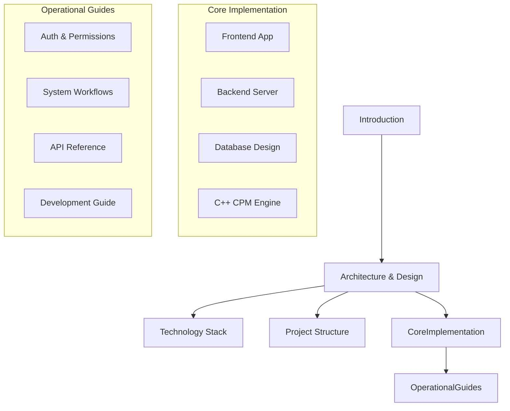

# Critical Path Method (CPM) Platform

Welcome to the documentation for the **Critical Path Method (CPM) Project Management Platform**. This system combines a high-performance compiled C++ scheduling engine with a real-time collaborative Next.js web application.

:::info
This platform is designed for projects with complex, nested dependencies where date changes trigger scheduling impacts throughout the network.
:::

---

## 🎯 Problem & Solution

### The Challenge
Standard project management systems (like Trello or Jira) excel at tracking flat task backlogs but struggle with complex dependency structures:
- Changes in one task's duration have silent, compounding impacts on downstream dependencies.
- Identifying the **critical path** (the sequence of dependent tasks determining the minimum project duration) is difficult to compute on the fly.
- Performing full scheduling passes over thousands of tasks is computationally expensive in standard JavaScript runtimes.

### The Solution
Our scheduling platform solves these problems through:
1. **Native C++ Performance**: A compiled scheduling engine (`cpm_cli`) runs topological sorts and float calculations in microseconds.
2. **Interactive Node Layouts**: Render dependency networks using React Flow (`@xyflow/react`) with dynamic layout positioning.
3. **Chronological Gantt Timelines**: Drag-and-drop timeline bars, filter weekends, and highlight scheduling float times.
4. **Real-time Sync**: Keep all team members synchronized instantly via a persistent WebSocket bridge.

---

## 🗺️ Documentation Map

Explore the system design and developer guides in the following sections:

- **[System Architecture](architecture.mdx)** — Layout of component boundaries and IPC loops.
- **[Technology Stack](tech-stack.mdx)** — Deep-dive into technical decisions and framework dependencies.
- **[Project Structure](project-structure.mdx)** — File directory layout.
- **[Frontend Application](frontend.mdx)** — React components, React Flow canvas, and custom Gantt schedulers.
- **[Backend Integration](backend.mdx)** — Next.js routing, child-process spawner, and WebSocket event bridge.
- **[Database Schema](database.mdx)** — Entity relations, unique keys, and volume benchmarks.
- **[CPM Engine Reference](cpm_engine.mdx)** — Algorithmic implementation, math formulas, and JavaScript fallbacks.
- **[System Workflows](workflows.mdx)** — Sequence maps for logins, schedule computations, and XML imports.
- **[API Reference Guide](api.mdx)** — Route parameters, request payloads, and status codes.
- **[Authentication & Roles](authentication.mdx)** — Argon2 password hashing, JWT sessions, and RBAC policies.
- **[State Management](state-management.mdx)** — Local Zustand variables, React Query caches, and socket syncs.
- **[Deployment Guide](deployment.mdx)** — CMake compiler targets, environment flags, and PaaS hosting.
- **[Development Guide](development-guide.mdx)** — Running tests, local seeding, and volume stresses.
- **[Glossary](glossary.mdx)** — Key project management and algebraic terminology.
