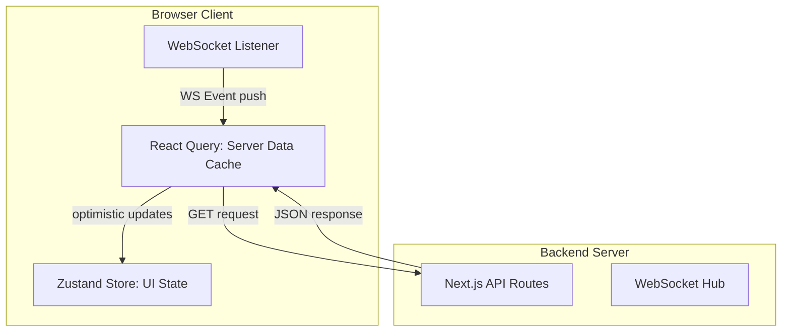

# State Management & Client-Server Sync

This document details the state management architecture of the CPM platform, outlining how client-side UI states, server-cached data, and real-time WebSocket events are coordinated.

---

## 1. State Management Architecture Overview

The application divides state into three distinct scopes:
1. **Transient UI State**: Client-only states (e.g. open sidebars, active workspaces, zooming levels) managed by **Zustand**.
2. **Server Cache State**: Remote database records (e.g. task titles, dependency links, CPM snapshots) cached locally by **TanStack React Query**.
3. **Real-time Broadcasts**: Collaborative state synchronization (e.g. peer cursor movements, task updates, calculation completions) pushed via **WebSockets**.



---

## 2. Transient UI State via Zustand (`workspaceStore.ts`)

Global UI state is managed by the Zustand store located in `apps/web/src/store/workspaceStore.ts`.
- **Purpose**: Tracks workspace navigation, active project contexts, search queries, sidebar toggles, and panel layouts.
- **Why Zustand**: Unlike React Context, Zustand does not trigger re-renders on components that consume unrelated slices of state. This is critical for performance in the React Flow graph view, where nodes must render smoothly without lag.

### Key State Fields:
- `currentWorkspaceId` (string | null): The active workspace context.
- `currentProjectId` (string | null): The project currently loaded in the viewer.
- `sidebarOpen` (boolean): Sidebar expansion toggle.
- `searchQuery` (string): Active search query.
- `selectedTaskId` (string | null): Task selected in the task detail sidebar.

---

## 3. Server State Caching via TanStack React Query

Remote data fetching, caching, and cache invalidation are managed by TanStack React Query:
- **Automatic Caching**: Fetched tasks and dependencies are cached in memory. Subsequent navigation between tabs (e.g. switching from Tasks list to Gantt chart) reads from the query cache instantly without triggering redundant API requests.
- **Background Refetching**: Stale queries are refetched in the background when the user refocused the window.

### Query Invalidation Pattern
When a user updates a task duration, a mutation is executed. Upon success, React Query invalidates related cache keys:

```typescript
const queryClient = useQueryClient();

const updateTaskMutation = useMutation({
  mutationFn: async (updatedTask) => {
    const res = await fetch(`/api/v1/projects/${projectId}/tasks/${updatedTask.id}`, {
      method: 'PUT',
      body: JSON.stringify(updatedTask),
    });
    return res.json();
  },
  onSuccess: (data) => {
    // Invalidate task queries so tables refetch fresh data
    queryClient.invalidateQueries({ queryKey: ['tasks', projectId] });
    
    // Invalidate CPM results since task changes affect floats and dates
    queryClient.invalidateQueries({ queryKey: ['cpmResults', projectId] });
  }
});
```

---

## 4. Real-time WebSocket Synchronization

To support real-time collaboration, a global `WebSocketListener` component wraps the authenticated layout:
1. **Connection**: On page mount, the listener initiates a persistent WebSocket connection.
2. **Channel Subscription**: When a project is loaded, the client sends a subscribe message:
   ```json
   { "action": "join_room", "room": "project:c4b4a11f-db9f" }
   ```
3. **Incoming Event Handlers**:
   - **`task_created` / `task_updated` / `task_deleted`**: Triggers a query cache invalidation for `['tasks', projectId]`.
   - **`dependency_created` / `dependency_deleted`**: Triggers invalidations for both tasks and dependency cache keys.
   - **`cpm_run_completed`**: Triggers a refetch of the scheduling results cache key `['cpmResults', projectId]`. All client views (graph overlays, Gantt bars, slack badges) update automatically.
