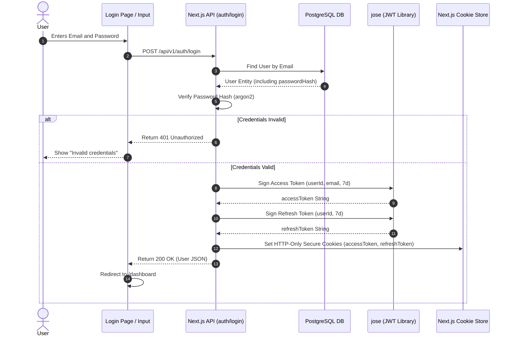
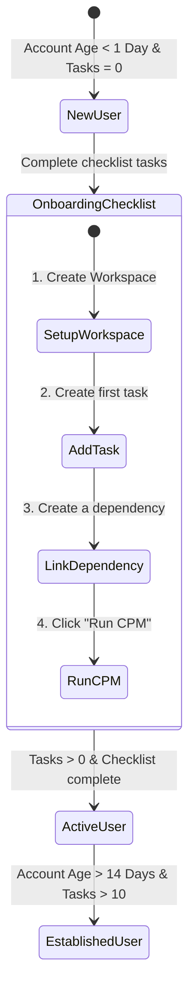
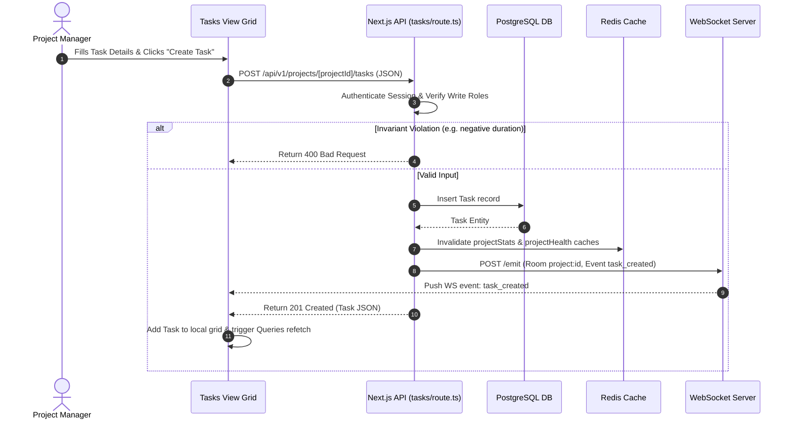
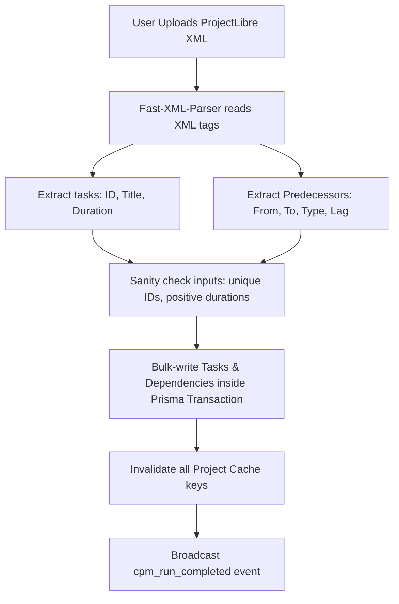

# Key Platform Workflows & Sequence Maps

This document details the core workflows of the CPM platform, mapping client interactions, database queries, background calculations, and real-time events.

---

## 1. User Session & Authentication Workflow

This workflow handles user authentication, session creation using HTTP-only cookies, and session verification using React cache deduplication.

---

## 2. Onboarding State Machine & Dashboard Initialization

To reduce user churn, the dashboard implements a progressive initialization state machine based on account age and task counts:

The `get_dashboard_data` service sends onboarding metadata (setup checklist completion percentages and current initialization stage) to customize the dashboard view.

---

## 3. Task Creation & Dependency Verification

This workflow handles creating tasks and updating scheduling networks, verifying that changes do not introduce circular dependencies.

---

## 4. ProjectLibre XML Import Workflow

Users can import existing schedules from ProjectLibre XML files:

---

## 5. Real-Time WebSocket Synchronization

Real-time synchronization ensures that when any project member updates a task, the changes are instantly reflected on all other members' active screens.
- **Connection**: On page mount, `WebSocketListener.tsx` connects to the WebSocket server using `ws://localhost:3000?token=JWT_TOKEN`.
- **Subscription**: The listener sends a `join_project` message containing the room identifier: `project:${projectId}`. The server validates project membership and adds the socket connection to the room.
- **Broadcast**: When a user modifies a task (e.g. changing status to `IN_PROGRESS`), the API route processes the database write and triggers an emit request. The WebSocket server pushes this change to all other clients subscribed to the project room, triggering an automatic cache invalidation and UI refresh.
