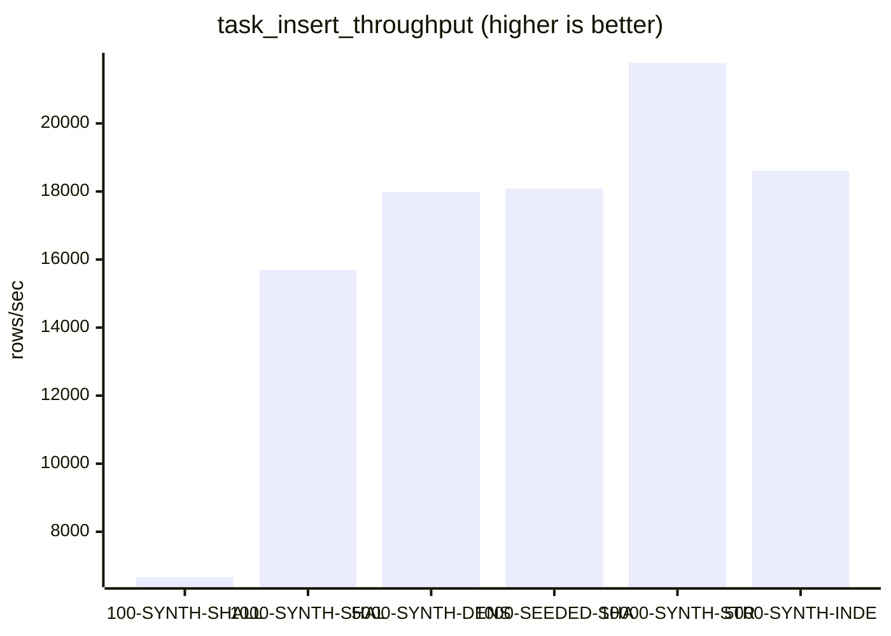
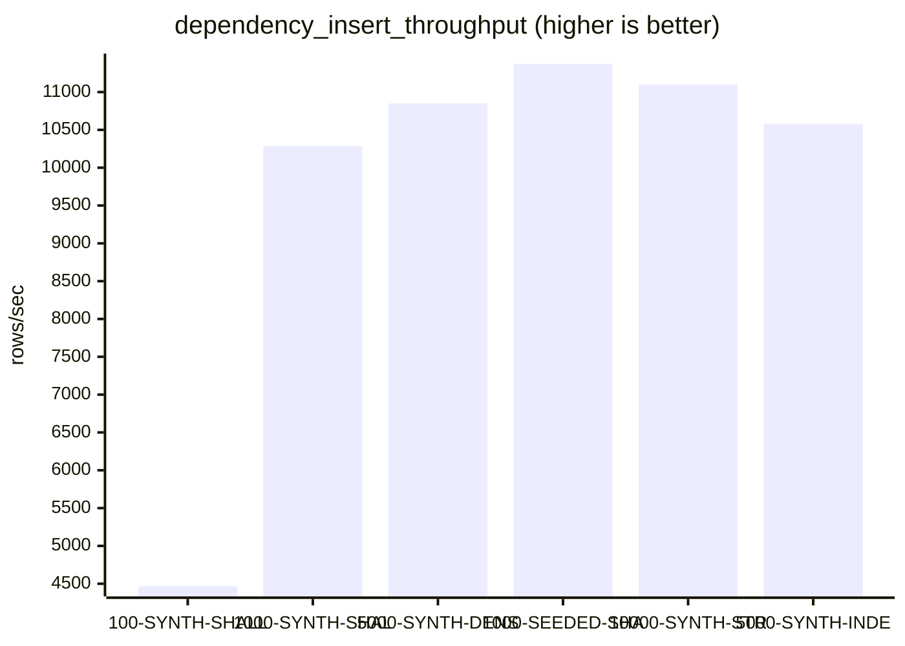
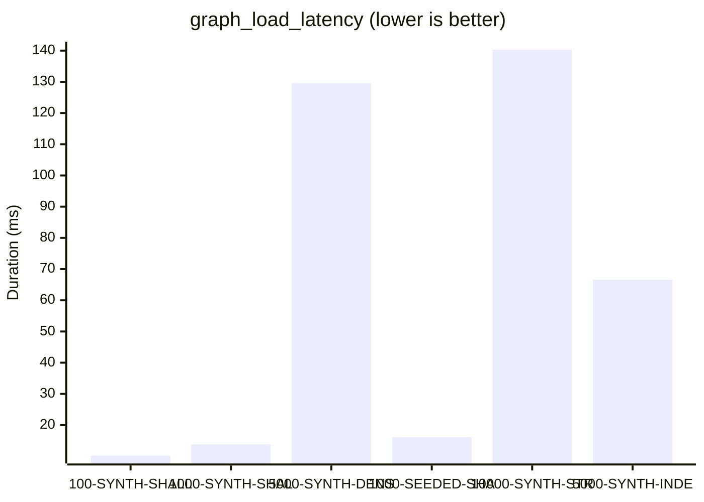
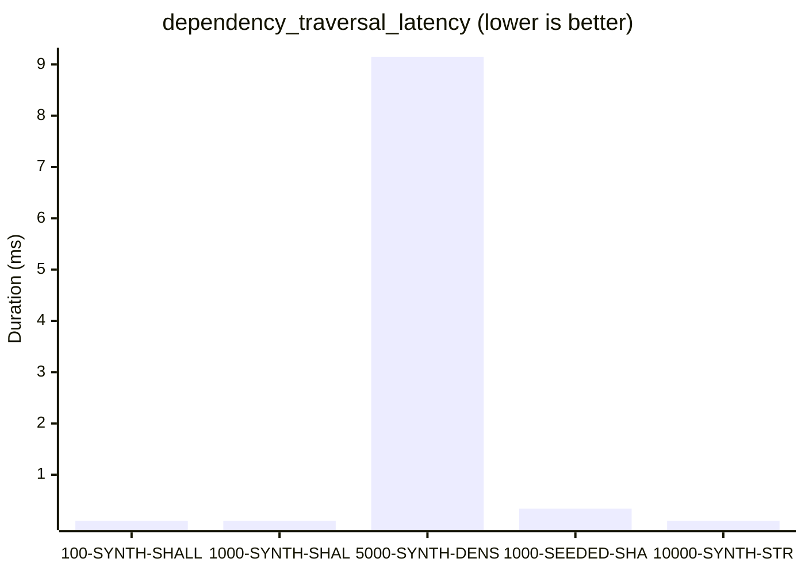
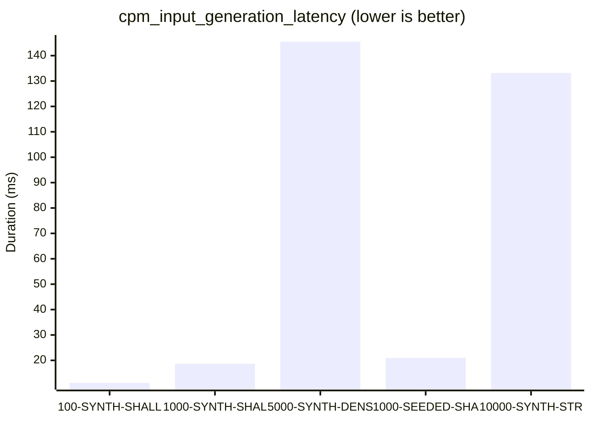
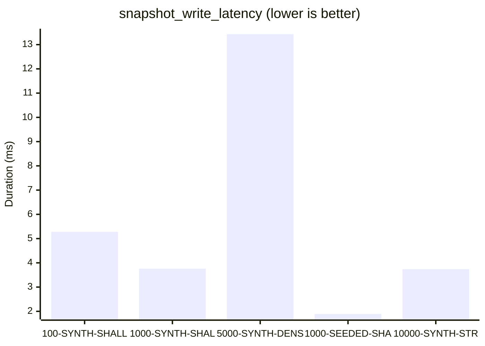
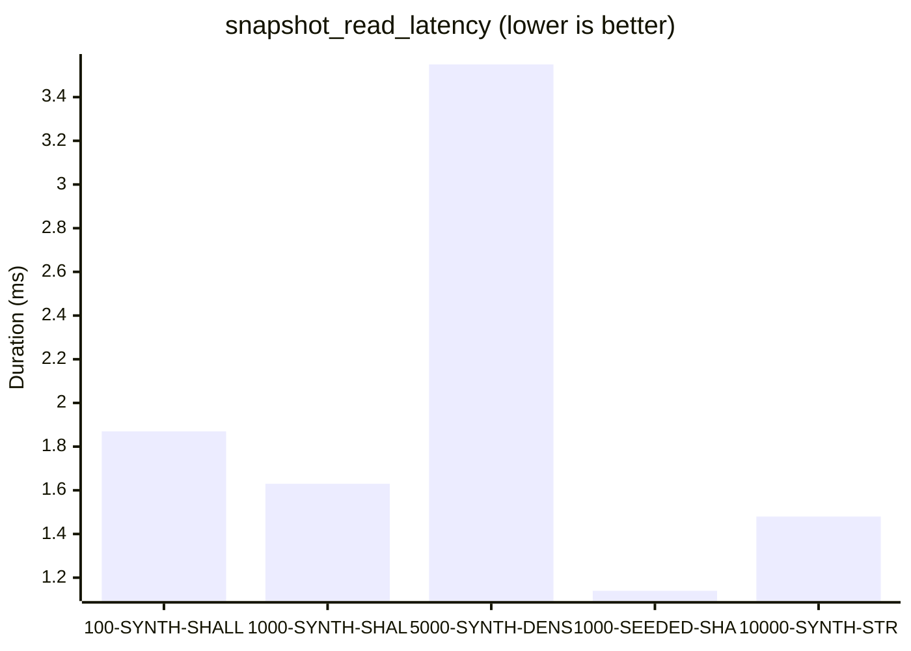
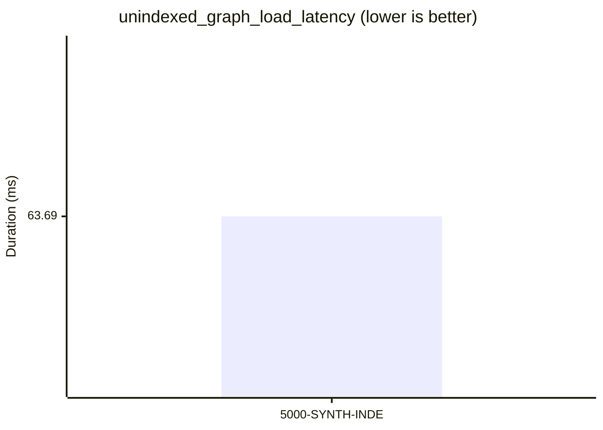

# Database Benchmark Visualizations
Generated from matrix report run at `2026-06-02T07:20:24.704Z` (`full` profile).

## Throughput Comparisons

### task_insert_throughput

### dependency_insert_throughput

## Latency Comparisons

### graph_load_latency

### dependency_traversal_latency

### cpm_input_generation_latency

### snapshot_write_latency

### snapshot_read_latency

### unindexed_graph_load_latency

---
### Tabular Metrics Summary

| Scenario | Operation | Duration (ms) | Value | Unit |
| --- | --- | --- | --- | --- |
| SCN-100-SYNTH-SHALLOW | task_insert_throughput | 15.00 | 6665.36 | rows/sec |
| SCN-100-SYNTH-SHALLOW | dependency_insert_throughput | 15.45 | 4466.81 | rows/sec |
| SCN-100-SYNTH-SHALLOW | graph_load_latency | 10.24 | 169.00 | rows_loaded |
| SCN-100-SYNTH-SHALLOW | dependency_traversal_latency | 0.02 | 7.00 | nodes_traversed |
| SCN-100-SYNTH-SHALLOW | cpm_input_generation_latency | 11.10 | 100.00 | tasks_serialized |
| SCN-100-SYNTH-SHALLOW | snapshot_write_latency | 5.28 | 25.00 | snapshot_id_len |
| SCN-100-SYNTH-SHALLOW | snapshot_read_latency | 1.87 | 1.00 | record_found |
| SCN-1000-SYNTH-SHALLOW | task_insert_throughput | 63.71 | 15695.43 | rows/sec |
| SCN-1000-SYNTH-SHALLOW | dependency_insert_throughput | 31.51 | 10282.62 | rows/sec |
| SCN-1000-SYNTH-SHALLOW | graph_load_latency | 13.82 | 1324.00 | rows_loaded |
| SCN-1000-SYNTH-SHALLOW | dependency_traversal_latency | 0.01 | 1.00 | nodes_traversed |
| SCN-1000-SYNTH-SHALLOW | cpm_input_generation_latency | 18.62 | 1000.00 | tasks_serialized |
| SCN-1000-SYNTH-SHALLOW | snapshot_write_latency | 3.76 | 25.00 | snapshot_id_len |
| SCN-1000-SYNTH-SHALLOW | snapshot_read_latency | 1.63 | 1.00 | record_found |
| SCN-5000-SYNTH-DENSE | task_insert_throughput | 278.13 | 17977.25 | rows/sec |
| SCN-5000-SYNTH-DENSE | dependency_insert_throughput | 1110.15 | 10849.84 | rows/sec |
| SCN-5000-SYNTH-DENSE | graph_load_latency | 129.57 | 17045.00 | rows_loaded |
| SCN-5000-SYNTH-DENSE | dependency_traversal_latency | 9.15 | 4475.00 | nodes_traversed |
| SCN-5000-SYNTH-DENSE | cpm_input_generation_latency | 145.48 | 5000.00 | tasks_serialized |
| SCN-5000-SYNTH-DENSE | snapshot_write_latency | 13.43 | 25.00 | snapshot_id_len |
| SCN-5000-SYNTH-DENSE | snapshot_read_latency | 3.55 | 1.00 | record_found |
| SCN-1000-SEEDED-SHALLOW | task_insert_throughput | 55.30 | 18083.34 | rows/sec |
| SCN-1000-SEEDED-SHALLOW | dependency_insert_throughput | 87.84 | 11372.70 | rows/sec |
| SCN-1000-SEEDED-SHALLOW | graph_load_latency | 16.14 | 1999.00 | rows_loaded |
| SCN-1000-SEEDED-SHALLOW | dependency_traversal_latency | 0.34 | 1000.00 | nodes_traversed |
| SCN-1000-SEEDED-SHALLOW | cpm_input_generation_latency | 20.97 | 1000.00 | tasks_serialized |
| SCN-1000-SEEDED-SHALLOW | snapshot_write_latency | 1.89 | 25.00 | snapshot_id_len |
| SCN-1000-SEEDED-SHALLOW | snapshot_read_latency | 1.14 | 1.00 | record_found |
| SCN-10000-SYNTH-STRESS | task_insert_throughput | 459.15 | 21779.26 | rows/sec |
| SCN-10000-SYNTH-STRESS | dependency_insert_throughput | 268.81 | 11100.87 | rows/sec |
| SCN-10000-SYNTH-STRESS | graph_load_latency | 140.32 | 12984.00 | rows_loaded |
| SCN-10000-SYNTH-STRESS | dependency_traversal_latency | 0.01 | 1.00 | nodes_traversed |
| SCN-10000-SYNTH-STRESS | cpm_input_generation_latency | 133.19 | 10000.00 | tasks_serialized |
| SCN-10000-SYNTH-STRESS | snapshot_write_latency | 3.74 | 25.00 | snapshot_id_len |
| SCN-10000-SYNTH-STRESS | snapshot_read_latency | 1.48 | 1.00 | record_found |
| SCN-5000-SYNTH-INDEX-IMPACT | task_insert_throughput | 268.66 | 18611.19 | rows/sec |
| SCN-5000-SYNTH-INDEX-IMPACT | dependency_insert_throughput | 236.11 | 10579.98 | rows/sec |
| SCN-5000-SYNTH-INDEX-IMPACT | graph_load_latency | 66.60 | 7498.00 | rows_loaded |
| SCN-5000-SYNTH-INDEX-IMPACT | unindexed_graph_load_latency | 63.69 | 7498.00 | rows_loaded |